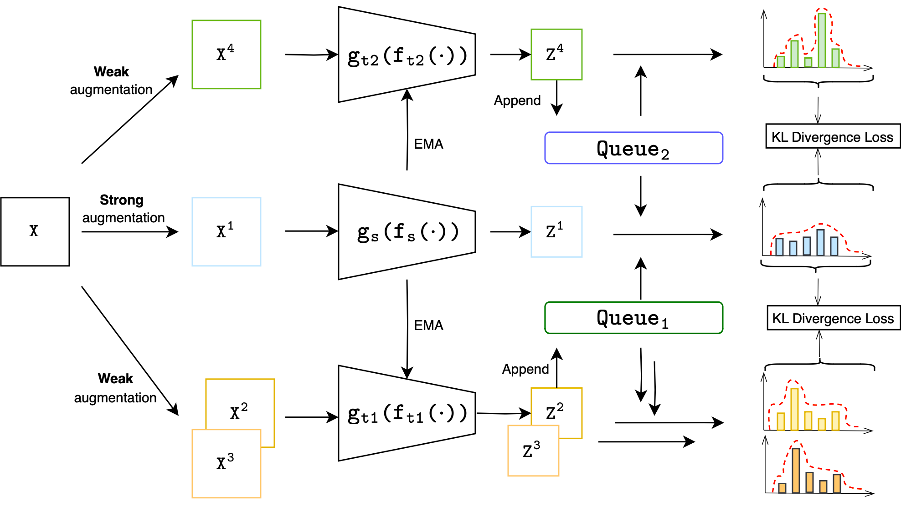
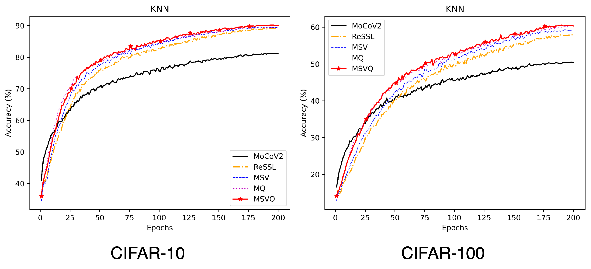

# MSVQ: Self-Supervised Learning with Multiple Sample Views and Queues

This is an anonymous submission PyTorch implementation of MSVQ proposed by our paper [MSVQ: Self-Supervised Learning with Multiple Sample Views and Queues]




## Requirements
To install requirements:

 ```setup
 # name: d2lpy39
 conda env create -f environment.yml
 ```

## Training
(You need to create the directory './stdout', you can also omit '>stdout/*' so that you can run these commands directly.)
To train the model(s) in the paper, run those commands:

```train
nohup python main.py --name msvq --m1 0.99  --m2 0.95 --dataset cifar10       --tem 0.04 --weak --gpuid 0 --queue_size 4096 --logdir cifar10_00 >stdout/cifar10_00 2>&1 &
nohup python main.py --name msvq --m1 0.99  --m2 0.93 --dataset cifar100      --tem 0.03 --weak --gpuid 0 --queue_size 4096 --logdir cifar100_00 >stdout/cifar100_00 2>&1 &
nohup python main.py --name msvq --m1 0.996 --m2 0.99 --dataset stl10         --tem 0.04 --weak --gpuid 0 --queue_size 16384 --logdir stl10_00 >stdout/stl10_00 2>&1 &
nohup python main.py --name msvq --m1 0.996 --m2 0.99 --dataset tinyimagenet  --tem 0.04 --weak --gpuid 0 --queue_size 16384 --logdir tinyimagenet_00 >stdout/tinyimagenet_00 2>&1 &
```

## Evaluation

To evaluate our model on CIFAR10/100, STL10 and Tiny-imagenet, run:
```eval
nohup python linear_eval.py --name msvq --dataset cifar10       --gpuid 0  --logdir cifar10_00 >stdout/cifar10_00_01 2>&1 &
nohup python linear_eval.py --name msvq --dataset cifar100      --gpuid 0  --logdir cifar100_00 >stdout/cifar100_00_01 2>&1 &
nohup python linear_eval.py --name msvq --dataset stl10         --gpuid 0  --logdir stl10_00 >stdout/stl10_00_01 2>&1 &
nohup python linear_eval.py --name msvq --dataset tinyimagenet  --gpuid 0  --logdir tinyimagenet_00 >stdout/tinyimagenet_00_01 2>&1 &
```

## Pre-trained Models

You can download pretrained models here:

- [this link](https://drive.google.com/file/d/1uFH5BfbVoLbEpw4MZJqtNbKmpATjrtV4/view?usp=sharing) trained on four datasets.
- Download and place in the **"./checkpoints"** directory

## Results

Our model achieves the following performance:

### Image Classification on four datasets

| -              | CIFAR-10  | CIFAR-100 | STL-10    | Tiny ImageNet |
|----------------|-----------|-----------|-----------|---------------|
| MoCoV2         | 86.18     | 59.51     | 85.88     | 43.36         |
| **MSVQ(Ours)** | **91.46** | **66.28** | **90.36** | **48.09**     |
> 
> 
## Contributors and Contact
>📋  If there are any questions, feel free to contact with the authors.
